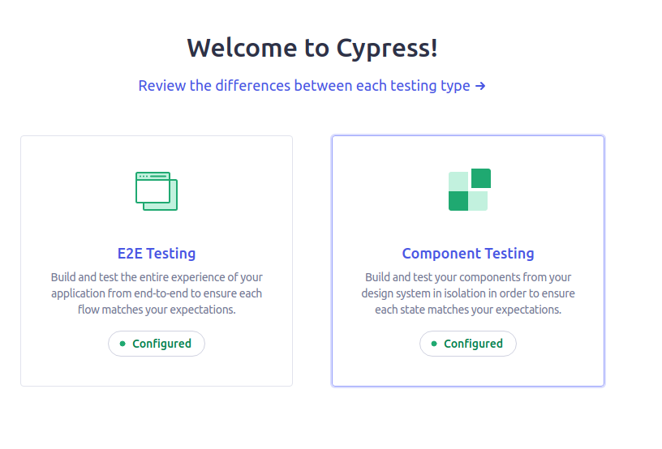
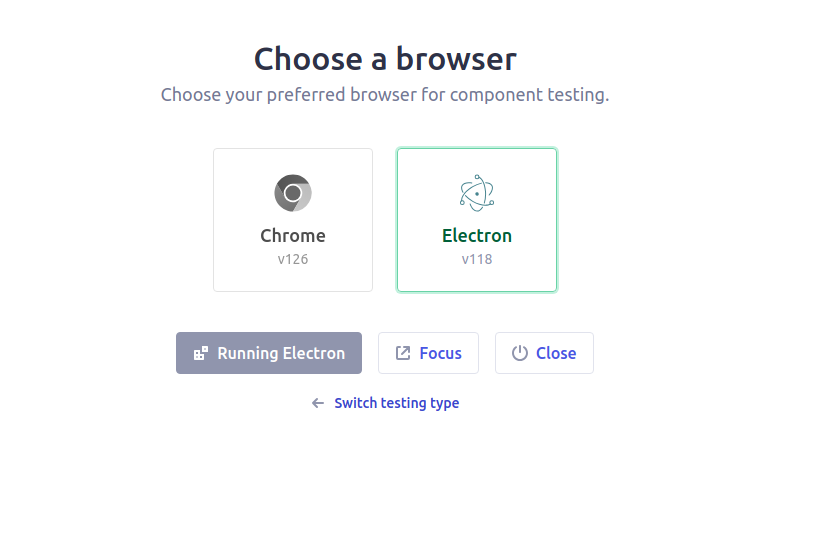
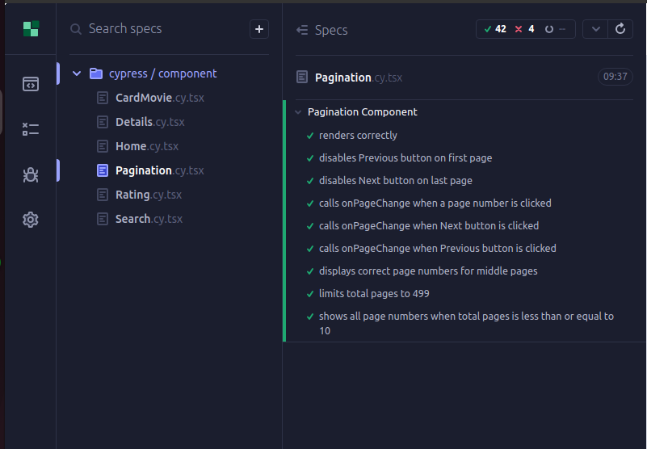

# Cinemarto Movie Search Application

## Table of Contents

- [Cinemarto Movie Search Application](#cinemarto-movie-search-application)
  - [Table of Contents](#table-of-contents)
  - [Overview](#overview)
  - [Features](#features)
  - [Setup Instructions](#setup-instructions)
    - [Prerequisites](#prerequisites)
    - [Install Dependencies](#install-dependencies)
    - [Running the App](#running-the-app)
    - [Running the App test](#running-the-app-test)

## Overview

The Movie Search Application is a React-based web application that allows users to search for movies, view a list of movies, and explore detailed information about each movie. The application uses TypeScript, Redux Toolkit, and `react-router-dom` for state management and routing.

## Features

- **Search Functionality**: Allows users to search for movies using a search bar.
- **Movie List**: Displays a list of movies with their titles, ratings, and release dates.
- **Movie Details**: Detailed view for each movie, showing more in-depth information.
- **Pagination**: Supports pagination for navigating through search results.
- **Debounced Search**: Implements debounced input to optimize API calls and improve performance.
- **Responsive Design**: Works well on both desktop and mobile devices.

## Setup Instructions

### Prerequisites

- Node.js (v18.18 or higher)
- npm or yarn package manager

### Install Dependencies

Using npm:

```bash
npm install
```
Using yarn:

```bash
yarn 
```

### Running the App

To start the development server:

```bash
npm run dev
```
Using yarn:

```bash
yarn run dev
``` 

### Running the App test

To start the cypress test

```bash
npm run cypress:open
```
Using yarn:

```bash
yarn run cypress:open
```
then select the one of the folloing option:

```bash
please select Component Testing
```
then you can chose between chourom or electron verion 




